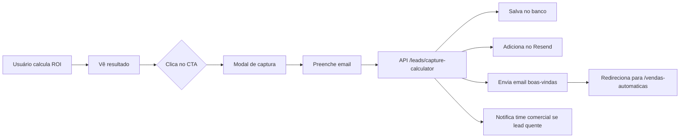

# 🚀 Setup: SEO & Email Marketing

## 📋 Páginas Criadas

Foram criadas 3 páginas segmentadas da calculadora ROI:

1. **Corretores de Imóveis**: `/ferramentas/calculadora-roi-corretores`
2. **Energia Solar**: `/ferramentas/calculadora-roi-energia-solar`
3. **Agências de Marketing**: `/ferramentas/calculadora-roi-agencias`

### ✨ Features de cada página:

- ✅ **SEO Otimizado**: Meta tags, Open Graph, keywords específicas do nicho
- ✅ **Conteúdo Personalizado**: Hero, benefícios e cases adaptados para cada segmento
- ✅ **Social Proof**: Números específicos de cada mercado
- ✅ **URL Tracking**: Parâmetro `?origem=calc-{nicho}` para rastreamento
- ✅ **Design Responsivo**: Mobile-first, otimizado para conversão

---

## 🎯 Integração com Email Marketing

### Arquivos Criados:

1. **`lib/email-marketing.ts`**: Sistema completo de captura e automação
2. **`components/lead-capture-modal.tsx`**: Modal de captura de leads
3. **`app/api/leads/capture-calculator/route.ts`**: API endpoint

### 📦 Instalação do Resend

```bash
npm install resend
```

### 🔑 Configuração das Variáveis de Ambiente

Adicione no arquivo `.env`:

```env
# Resend API (https://resend.com)
RESEND_API_KEY=re_xxxxxxxxxxxxxxxxxxxxx
RESEND_AUDIENCE_ID=xxxxxxxx-xxxx-xxxx-xxxx-xxxxxxxxxxxx

# Email do time comercial para notificações de leads quentes
COMMERCIAL_TEAM_EMAIL=comercial@roilabs.com.br
```

### 📧 Setup do Resend

1. Crie conta em [resend.com](https://resend.com)
2. Adicione o domínio `siriuscrm.com.br`
3. Configure DNS records (SPF, DKIM, DMARC)
4. Crie uma Audience para os leads
5. Copie a API Key e Audience ID para o `.env`

### 🎨 Template de Email

O sistema já inclui um template HTML completo em `lib/email-marketing.ts`:

- Design responsivo
- Resultado personalizado da calculadora
- CTA direcionado para a landing page
- Nicho-específico (adapta o texto automaticamente)

---

## 📊 Fluxo de Captura de Leads



### Lead "Quente" 🔥

Um lead é considerado **quente** quando:
- Perda mensal estimada > R$ 10.000
- Time comercial é notificado automaticamente

---

## 🎯 Como Usar nos Componentes

### Opção 1: Modal de Captura (Recomendado)

```tsx
import { LeadCaptureModal } from '@/components/lead-capture-modal'

function MinhaCalculadora() {
  const [showModal, setShowModal] = useState(false)

  return (
    <>
      <Button onClick={() => setShowModal(true)}>
        Ver Resultado Completo
      </Button>

      <LeadCaptureModal
        open={showModal}
        onClose={() => setShowModal(false)}
        volumeLeads={100}
        ticketMedio={500}
        perdaMensal={12500}
        origem="calculadora-corretores"
        onSuccess={() => {
          // Lead capturado com sucesso
        }}
      />
    </>
  )
}
```

### Opção 2: Função Direta

```tsx
import { captureLeadFromCalculator } from '@/lib/email-marketing'

async function handleCapture() {
  await captureLeadFromCalculator({
    email: 'usuario@email.com',
    nome: 'João Silva',
    empresa: 'Empresa XYZ',
    volumeLeads: 100,
    ticketMedio: 500,
    perdaMensal: 12500,
    origem: 'calculadora-agencias'
  })
}
```

---

## 🔄 Sequência de Emails (Drip Campaign)

O sistema está preparado para automação de emails:

**Dia 0**: Email de boas-vindas com resultado
**Dia 2**: Case de sucesso do nicho específico
**Dia 4**: Convite para demonstração gratuita
**Dia 7**: Oferta especial (se ainda não converteu)

### Para ativar:

Use ferramentas de automação como:
- [Resend](https://resend.com) + Cron jobs
- [n8n.io](https://n8n.io) (self-hosted)
- [Make.com](https://make.com)
- [Zapier](https://zapier.com)

---

## 🎨 Personalização por Nicho

Cada página usa cores e ícones específicos:

| Nicho | Cor Principal | Ícone | Social Proof |
|-------|--------------|-------|--------------|
| Corretores | Indigo/Purple | Building2 | +2.500 usuários, 34% mais vendas |
| Energia Solar | Amber/Orange | Sun | +150 integradoras, 58% mais propostas |
| Agências | Purple/Pink | Sparkles | +380 agências, 47% mais propostas |

---

## 📈 Métricas para Acompanhar

Adicione tracking no Google Analytics 4:

```typescript
// lib/analytics.ts
export function trackCalculatorLead(data: {
  origem: string
  perdaMensal: number
}) {
  if (typeof window !== 'undefined' && window.gtag) {
    window.gtag('event', 'calculator_lead_capture', {
      page_location: window.location.href,
      origem: data.origem,
      perda_mensal: data.perdaMensal,
      is_hot_lead: data.perdaMensal > 10000
    })
  }
}
```

---

## 🚀 Checklist de Go-Live

- [ ] Instalar `npm install resend`
- [ ] Configurar variáveis de ambiente (RESEND_API_KEY, etc)
- [ ] Configurar domínio no Resend
- [ ] Validar DNS records (SPF, DKIM, DMARC)
- [ ] Testar captura de leads em ambiente de staging
- [ ] Configurar Google Analytics tracking
- [ ] Criar campanhas de anúncios direcionadas:
  - [ ] Google Ads: keywords de cada nicho
  - [ ] Facebook/Instagram: lookalike de clientes
  - [ ] LinkedIn: segmentação por cargo/empresa
- [ ] Implementar pixels de retargeting
- [ ] Configurar automação de emails (drip campaign)

---

## 🔗 URLs das Páginas

### Produção (siriuscrm.com.br):
- https://siriuscrm.com.br/ferramentas/calculadora-roi-corretores
- https://siriuscrm.com.br/ferramentas/calculadora-roi-energia-solar
- https://siriuscrm.com.br/ferramentas/calculadora-roi-agencias

### Desenvolvimento (localhost:3000):
- http://localhost:3000/ferramentas/calculadora-roi-corretores
- http://localhost:3000/ferramentas/calculadora-roi-energia-solar
- http://localhost:3000/ferramentas/calculadora-roi-agencias

---

## 💡 Próximos Passos Recomendados

1. **Blog Posts SEO**: Criar artigos linkando para cada calculadora
   - "Como corretores aumentam vendas em 34% com CRM"
   - "Guia completo de vendas para energia solar"
   - "Processo comercial escalável para agências"

2. **Vídeos Explicativos**: Gravar demos específicas por nicho

3. **Landing Pages de Conversão**: Uma landing para cada nicho

4. **Webinars**: "Como [nicho] aumenta faturamento com CRM"

5. **Parcerias**: Integrar com ferramentas de cada nicho
   - Corretores: Vista Software, Superlógica
   - Energia Solar: Aurora, Helioscope
   - Agências: RD Station, HubSpot

---

## 📞 Suporte

Dúvidas sobre a implementação? Entre em contato:
- Email: dev@roilabs.com.br
- Documentação Resend: https://resend.com/docs

---

**Última atualização**: 27/01/2025
