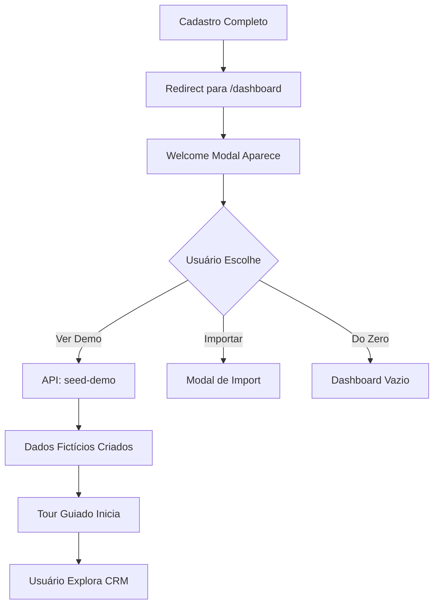

# Sistema de Onboarding com "Magic Data" 🚀

## 📋 Visão Geral

Sistema completo de onboarding que implementa a estratégia de **"Invisible Sales"** através do **povoamento inteligente de dados** e **tour guiado**. Em vez de apresentar um CRM vazio e desanimador, mostramos ao usuário o "futuro organizado" dele com dados fictícios prontos para exploração.

## ✨ Componentes Implementados

### 1. **Welcome Modal** (`welcome-modal.tsx`)

Modal de boas-vindas com 3 opções de início:

- ✨ **Ver Demonstração** (Recomendado)
  - Carrega dados fictícios automaticamente
  - Inicia tour guiado
  - 5 leads prontos
  - Pipeline organizado
  - 1 tarefa atrasada para senso de urgência

- 📤 **Importar Dados**
  - Excel/CSV (em desenvolvimento)
  - Google Contacts (planejado)

- ⚡ **Começar do Zero**
  - CRM limpo
  - Liberdade total de configuração

### 2. **Seed Demo Data** (`lib/seed-demo-data.ts`)

Função que popula o CRM com:

- **5 Contatos** fictícios (empresas variadas)
- **6 Negociações** em diferentes estágios:
  - 1 Novo Lead
  - 1 em Qualificação
  - 1 em Proposta
  - 1 em Negociação
  - 1 Fechado (venda ganha) 🎉
  - 1 **ATRASADO** (follow-up urgente) ⚠️

- **Notas** em cada deal (contexto realista)
- **Pipeline** completo com 5 estágios
- **Atividades** registradas

### 3. **Product Tour** (`product-tour.tsx`)

Sistema de tour guiado com tooltips flutuantes:

- **4 Steps** predefinidos:
  1. "Seu Funil de Vendas" (overview do pipeline)
  2. "Atenção: Tarefa Atrasada!" (urgência)
  3. "Arraste para Avançar" (interatividade)
  4. "Analytics & Insights" (métricas)

- **Recursos**:
  - Overlay escuro para destacar elementos
  - Navegação entre steps
  - Auto-scroll para elemento em foco
  - Highlight visual do elemento alvo
  - Detecção automática via URL params (`?tour=true`)

### 4. **Onboarding Wrapper** (`onboarding-wrapper.tsx`)

Componente wrapper que:
- Verifica se usuário precisa de onboarding
- Exibe Welcome Modal automaticamente
- Envolve a aplicação com TourProvider

### 5. **API Endpoint** (`/api/onboarding/seed-demo`)

Endpoint POST que:
- Autentica usuário via session
- Chama `seedDemoData()`
- Atualiza `OnboardingProgress` no banco
- Retorna resultado (sucesso/erro)

## 🎯 Fluxo de Uso

### Novo Usuário (Fluxo Recomendado)



### Integração com Dashboard

```tsx
// app/dashboard/page.tsx

// 1. Check onboarding status
const user = await prisma.user.findUnique({
  where: { email: session.user.email },
  include: {
    onboarding: true // ← Incluir onboarding progress
  }
})

const shouldShowOnboarding = !user.onboarding || user.onboarding.status === 'IN_PROGRESS'

// 2. Wrap com OnboardingWrapper
return (
  <OnboardingWrapper
    userId={user.id}
    userName={user.name}
    shouldShowOnboarding={shouldShowOnboarding}
  >
    <DashboardWithPipelineSelector {...props} />
  </OnboardingWrapper>
)
```

## 🏗️ Estrutura de Arquivos

```
components/onboarding/
├── index.ts                  # Exports centralizados
├── welcome-modal.tsx         # Modal de boas-vindas
├── product-tour.tsx          # Sistema de tour guiado
├── onboarding-wrapper.tsx    # Wrapper principal
└── README.md                 # Esta documentação

lib/
└── seed-demo-data.ts         # Lógica de seed de dados

app/api/onboarding/
└── seed-demo/
    └── route.ts              # Endpoint da API

prisma/schema.prisma
└── OnboardingProgress        # Model de progresso
```

## 🎮 Como Usar

### Marcar Elementos para Tour

Use `data-tour` attributes nos elementos que deseja destacar:

```tsx
// Exemplo: Kanban Board
<div data-tour="pipeline" className="...">
  {/* Pipeline completo */}
</div>

// Exemplo: Card atrasado
<div data-tour="overdue-task" className="...">
  {/* Deal atrasado */}
</div>

// Exemplo: Botão de analytics
<Button data-tour="analytics-button">
  Analytics
</Button>
```

### Iniciar Tour Manualmente

```tsx
import { useTour } from '@/components/onboarding'

function MyComponent() {
  const { startTour } = useTour()

  const handleStartTour = () => {
    startTour([
      {
        id: 'step1',
        target: '[data-tour="my-element"]',
        title: 'Título do Step',
        content: 'Descrição...',
        placement: 'bottom'
      },
      // ... mais steps
    ])
  }

  return <Button onClick={handleStartTour}>Iniciar Tour</Button>
}
```

### Customizar Steps do Tour

```tsx
// Edite em: components/onboarding/product-tour.tsx

const startDefaultTour = () => {
  const defaultSteps: TourStep[] = [
    {
      id: 'welcome',
      target: '[data-tour="pipeline"]',
      title: '🎯 Seu Funil de Vendas',
      content: 'Descrição...',
      placement: 'bottom',
    },
    // Adicione mais steps aqui
  ]

  startTour(defaultSteps)
}
```

## 📊 Banco de Dados

### OnboardingProgress Model

```prisma
model OnboardingProgress {
  id             String   @id @default(uuid())

  currentStep    Int      @default(0)
  completedSteps String[] @default([])

  status         OnboardingStatus @default(IN_PROGRESS)
  completedAt    DateTime?
  skippedAt      DateTime?

  stepData       Json?    // Metadados flexíveis
  badges         String[] @default([])
  totalPoints    Int      @default(0)

  userId         String   @unique
  organizationId String
}
```

### Status Tracking

- `IN_PROGRESS` - Onboarding em andamento
- `COMPLETED` - Onboarding concluído
- `SKIPPED` - Usuário pulou o onboarding

## 🎨 Customização

### Dados Fictícios

Para customizar os dados de demonstração, edite:

```typescript
// lib/seed-demo-data.ts

const demoContacts = [
  {
    name: 'Seu Nome',
    email: 'email@exemplo.com',
    company: 'Sua Empresa',
    // ...
  }
]

const demoDeals = [
  {
    title: 'Sua Negociação',
    value: 10000,
    // ...
  }
]
```

### Estilo do Tour

Para customizar a aparência dos tooltips:

```tsx
// components/onboarding/product-tour.tsx

<Card className="w-80 shadow-2xl border-2 border-indigo-500">
  {/* Customizar cores, tamanhos, etc. */}
</Card>

// CSS do highlight
.tour-highlight {
  box-shadow: 0 0 0 4px rgba(99, 102, 241, 0.5),
              0 0 0 9999px rgba(0, 0, 0, 0.5);
}
```

## 🚀 Melhorias Futuras

### Funcionalidades Planejadas

- [ ] **Import de CSV/Excel** - Implementar upload e parsing
- [ ] **Google Contacts Integration** - OAuth + sync
- [ ] **Tours Contextuais** - Tours diferentes por funcionalidade
- [ ] **Gamificação** - Badges, pontos, achievements
- [ ] **Onboarding Progressivo** - Steps ao longo do tempo
- [ ] **A/B Testing** - Testar diferentes abordagens
- [ ] **Analytics** - Track completion rate, time spent, etc.

### Tours Adicionais

```typescript
// Tour para Analytics
const analyticsSteps = [
  { target: '[data-tour="chart"]', title: 'Gráficos em Tempo Real', ... },
  { target: '[data-tour="metrics"]', title: 'Métricas de Conversão', ... },
]

// Tour para Automações
const automationSteps = [
  { target: '[data-tour="trigger"]', title: 'Configure Gatilhos', ... },
  { target: '[data-tour="action"]', title: 'Defina Ações', ... },
]
```

## 📈 Métricas & Analytics

### Track Onboarding Completion

```typescript
// Adicionar ao OnboardingProgress
interface OnboardingMetrics {
  startedAt: DateTime
  completedAt?: DateTime
  timeToComplete?: number // em minutos
  stepsCompleted: number
  demoDemoDataLoaded: boolean
  tourCompleted: boolean
}
```

### Analytics Events

```typescript
// Google Analytics / Mixpanel
gtag('event', 'onboarding_started', {
  user_id: userId,
  choice: 'demo' | 'import' | 'scratch'
})

gtag('event', 'onboarding_completed', {
  user_id: userId,
  time_to_complete: 120, // segundos
  steps_completed: 4
})

gtag('event', 'tour_step_viewed', {
  step_id: 'welcome',
  step_number: 1
})
```

## 🐛 Troubleshooting

### Modal não aparece

**Problema**: Welcome Modal não exibe após cadastro

**Solução**:
```typescript
// Verifique se shouldShowOnboarding está correto
const onboarding = await prisma.onboardingProgress.findUnique({
  where: { userId }
})

console.log('Onboarding status:', onboarding?.status)
```

### Tour não inicia

**Problema**: Tour não começa com `?tour=true`

**Solução**:
```typescript
// Verifique se TourProvider está envolvendo o componente
// e se os data-tour attributes existem

const element = document.querySelector('[data-tour="pipeline"]')
console.log('Element found:', element)
```

### Dados não carregam

**Problema**: Seed de dados falha

**Solução**:
```typescript
// Verifique logs do servidor
// Teste endpoint diretamente:
fetch('/api/onboarding/seed-demo', {
  method: 'POST'
}).then(r => r.json()).then(console.log)
```

## 🎓 Por Que Isso Funciona?

### Psicologia do "Estado Vazio"

Um CRM vazio é **deprimente e inútil**. O usuário não vê valor imediato.

### "Show, Don't Tell"

Em vez de explicar o que o CRM faz, mostramos funcionando com dados reais.

### Senso de Urgência

O deal atrasado cria um "hook" psicológico - o usuário quer resolver aquilo.

### Gamificação Sutil

O tour guiado transforma o onboarding em uma experiência interativa e divertida.

---

## 🤝 Contribuindo

Para adicionar novos tours ou melhorar o onboarding:

1. Adicione `data-tour` attributes nos elementos
2. Crie steps customizados em `product-tour.tsx`
3. Teste com `?tour=true` na URL
4. Documente aqui as mudanças

---

**Versão**: 1.0
**Data**: Janeiro 2026
**Autor**: Sirius CRM Team
