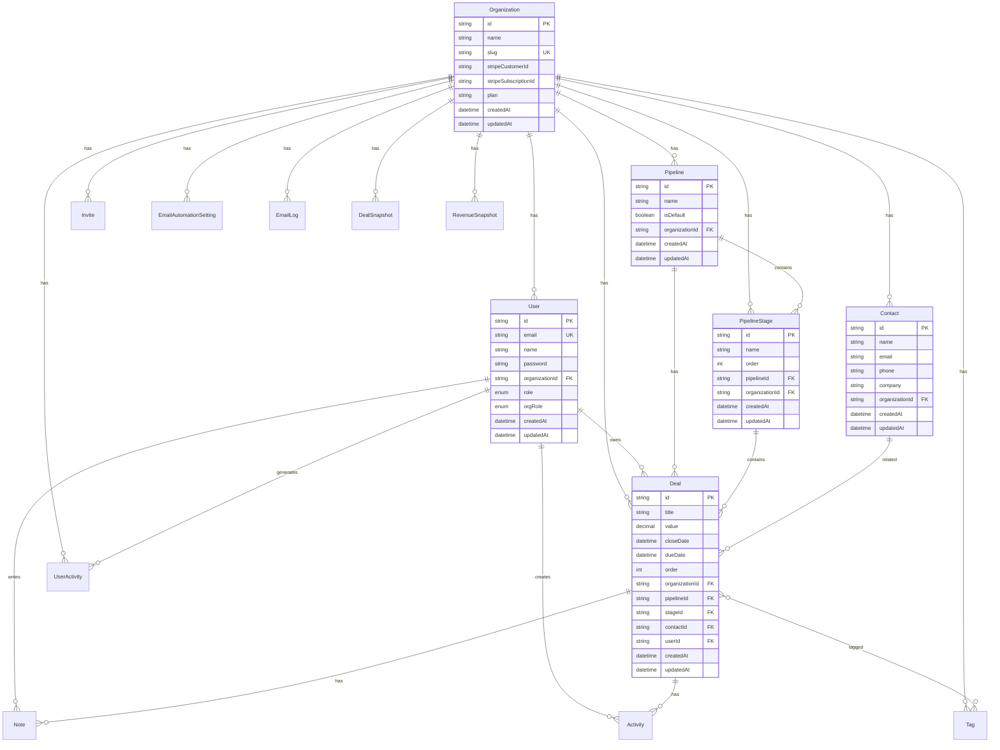

# 🗄️ Database - Sirius CRM

## Visão Geral

O Sirius CRM utiliza **PostgreSQL 15+** como banco de dados principal, gerenciado através do **Prisma ORM 5.19.0**. A arquitetura de dados é multi-tenant (isolamento por `organizationId`), com suporte completo a analytics, automações e billing.

## 📊 Schema Diagram



## 🏢 Core Models

### **Organization**
Representa uma conta/empresa no sistema (tenant principal).

```prisma
model Organization {
  id        String   @id @default(uuid())
  name      String
  slug      String   @unique
  createdAt DateTime @default(now())
  updatedAt DateTime @updatedAt

  // Stripe & Billing
  stripeCustomerId     String?
  stripeSubscriptionId String?
  plan                 String @default("FREE") // FREE, PRO

  // Relations
  users                   User[]
  contacts                Contact[]
  deals                   Deal[]
  pipelines               Pipeline[]
  pipelineStages          PipelineStage[]
  invites                 Invite[]
  tags                    Tag[]
  emailAutomationSettings EmailAutomationSetting[]
  emailLogs               EmailLog[]
  dealSnapshots           DealSnapshot[]
  userActivities          UserActivity[]
  revenueSnapshots        RevenueSnapshot[]
}
```

**Campos-chave:**
- `slug`: URL-friendly identifier único
- `plan`: Plano atual (FREE/PRO) - controla feature gates
- `stripeCustomerId`: Link com conta Stripe
- `stripeSubscriptionId`: Assinatura ativa

### **User**
Usuários da plataforma (membros de organizações).

```prisma
model User {
  id        String   @id @default(uuid())
  email     String   @unique
  name      String?
  password  String   // bcrypt hash
  createdAt DateTime @default(now())
  updatedAt DateTime @updatedAt

  organizationId String
  organization   Organization @relation(fields: [organizationId], references: [id])

  deals          Deal[]
  notes          Note[]
  activities     Activity[]
  emailLogs      EmailLog[]
  userActivities UserActivity[]

  role    Role    @default(USER)     // USER, ADMIN
  orgRole OrgRole @default(MEMBER)   // OWNER, MEMBER
}
```

**Enums:**
```prisma
enum Role {
  USER   // Usuário regular
  ADMIN  // Admin da plataforma (ROI Labs)
}

enum OrgRole {
  OWNER  // Dono da organização (full access)
  MEMBER // Membro da equipe (limited access)
}
```

### **Contact**
Leads e clientes (base de contatos).

```prisma
model Contact {
  id        String   @id @default(uuid())
  name      String
  email     String?
  phone     String?
  company   String?
  createdAt DateTime @default(now())
  updatedAt DateTime @updatedAt

  organizationId String
  organization   Organization @relation(fields: [organizationId], references: [id])

  deals Deal[]

  @@index([organizationId])
}
```

### **Pipeline & PipelineStage**
Fluxos de vendas e suas etapas.

```prisma
model Pipeline {
  id        String   @id @default(uuid())
  name      String
  isDefault Boolean  @default(false)
  createdAt DateTime @default(now())
  updatedAt DateTime @updatedAt

  organizationId String
  organization   Organization @relation(fields: [organizationId], references: [id], onDelete: Cascade)

  stages PipelineStage[]
  deals  Deal[]

  @@index([organizationId, isDefault])
}

model PipelineStage {
  id        String   @id @default(uuid())
  name      String   // "Prospecção", "Qualificação", etc.
  order     Int      // Para ordenação (1, 2, 3...)
  createdAt DateTime @default(now())
  updatedAt DateTime @updatedAt

  organizationId String
  organization   Organization @relation(fields: [organizationId], references: [id])

  pipelineId String
  pipeline   Pipeline @relation(fields: [pipelineId], references: [id], onDelete: Cascade)

  deals Deal[]

  @@index([pipelineId, order])
  @@index([organizationId, pipelineId])
}
```

### **Deal**
Oportunidades de venda (core do CRM).

```prisma
model Deal {
  id        String    @id @default(uuid())
  title     String
  value     Decimal?  @db.Decimal(10, 2)
  closeDate DateTime?
  dueDate   DateTime? // Follow-up date
  order     Int?      // Manual sorting in Kanban
  createdAt DateTime  @default(now())
  updatedAt DateTime  @updatedAt

  organizationId String
  organization   Organization @relation(fields: [organizationId], references: [id])

  pipelineId String
  pipeline   Pipeline @relation(fields: [pipelineId], references: [id])

  stageId String
  stage   PipelineStage @relation(fields: [stageId], references: [id])

  contactId String?
  contact   Contact? @relation(fields: [contactId], references: [id])

  userId String
  user   User @relation(fields: [userId], references: [id])

  // Deal 2.0 features
  notes      Note[]
  tags       Tag[]
  activities Activity[]

  @@index([organizationId, stageId])
  @@index([userId])
}
```

## 🔐 Authentication & Authorization

### **Invite**
Sistema de convites para novos membros.

```prisma
model Invite {
  id        String   @id @default(uuid())
  email     String
  token     String   @unique
  role      OrgRole  @default(MEMBER)
  expiresAt DateTime
  createdAt DateTime @default(now())

  organizationId String
  organization   Organization @relation(fields: [organizationId], references: [id])

  @@unique([email, organizationId])
}
```

## 📝 Enhancements (Deal 2.0)

### **Note**
Notas e comentários em deals.

```prisma
model Note {
  id        String   @id @default(uuid())
  content   String
  createdAt DateTime @default(now())

  dealId String
  deal   Deal @relation(fields: [dealId], references: [id], onDelete: Cascade)

  userId String
  user   User @relation(fields: [userId], references: [id])
}
```

### **Tag**
Tags para categorização de deals.

```prisma
model Tag {
  id    String @id @default(uuid())
  name  String
  color String // hex color

  organizationId String
  organization   Organization @relation(fields: [organizationId], references: [id])

  deals Deal[] // Many-to-many
}
```

### **Activity**
Histórico de ações em deals.

```prisma
model Activity {
  id          String   @id @default(uuid())
  type        String   // "STAGE_CHANGE", "NOTE_ADDED", "VALUE_CHANGE"
  description String
  createdAt   DateTime @default(now())

  dealId String
  deal   Deal @relation(fields: [dealId], references: [id], onDelete: Cascade)

  userId String
  user   User @relation(fields: [userId], references: [id])
}
```

## 📧 Email Automation

### **EmailAutomationSetting**
Configurações de automações por organização.

```prisma
model EmailAutomationSetting {
  id      String               @id @default(uuid())
  type    EmailAutomationType
  enabled Boolean              @default(true)

  // Customization
  customSubject String?
  customBody    String? @db.Text

  // Advanced
  sendDelayMinutes  Int   @default(0)
  triggerConditions Json?

  createdAt DateTime @default(now())
  updatedAt DateTime @updatedAt

  organizationId String
  organization   Organization @relation(fields: [organizationId], references: [id], onDelete: Cascade)

  @@unique([organizationId, type])
}

enum EmailAutomationType {
  WELCOME_EMAIL
  DEAL_CREATED
  DEAL_STAGE_CHANGED
  UPGRADE_NUDGE
}
```

### **EmailLog**
Histórico de emails enviados.

```prisma
model EmailLog {
  id      String      @id @default(uuid())
  type    EmailAutomationType
  to      String
  subject String
  status  EmailStatus @default(SENT)

  sentAt      DateTime  @default(now())
  deliveredAt DateTime?
  openedAt    DateTime?
  clickedAt   DateTime?

  errorMessage String? @db.Text

  organizationId String
  organization   Organization @relation(fields: [organizationId], references: [id], onDelete: Cascade)

  userId String?
  user   User? @relation(fields: [userId], references: [id], onDelete: SetNull)

  @@index([organizationId, sentAt])
  @@index([status])
}

enum EmailStatus {
  SENT
  DELIVERED
  OPENED
  CLICKED
  BOUNCED
  FAILED
}
```

## 📊 Analytics & Data Warehouse

### **DealSnapshot**
Snapshots diários de deals (para analytics históricos).

```prisma
model DealSnapshot {
  id   String   @id @default(uuid())
  date DateTime // Data do snapshot (apenas dia, sem hora)

  // Métricas agregadas
  totalDeals   Int
  totalValue   Decimal @db.Decimal(12, 2)
  avgDealValue Decimal @db.Decimal(12, 2)

  // Breakdowns (JSON pre-aggregated)
  dealsByStage    Json // { "stageId": { count: X, value: Y } }
  dealsByPipeline Json // { "pipelineId": { count: X, value: Y } }

  // Conversão
  dealsCreated Int @default(0)
  dealsClosed  Int @default(0)
  dealsLost    Int @default(0)

  createdAt DateTime @default(now())

  organizationId String
  organization   Organization @relation(fields: [organizationId], references: [id], onDelete: Cascade)

  @@unique([organizationId, date])
  @@index([organizationId, date])
}
```

### **UserActivity**
Tracking de atividades de usuários.

```prisma
model UserActivity {
  id   String           @id @default(uuid())
  type UserActivityType

  metadata Json? // Dados adicionais flexíveis

  ipAddress String?
  userAgent String? @db.Text

  createdAt DateTime @default(now())

  userId String?
  user   User? @relation(fields: [userId], references: [id], onDelete: SetNull)

  organizationId String
  organization   Organization @relation(fields: [organizationId], references: [id], onDelete: Cascade)

  @@index([organizationId, createdAt])
  @@index([userId, createdAt])
  @@index([type, createdAt])
}

enum UserActivityType {
  LOGIN
  LOGOUT
  DEAL_CREATED
  DEAL_UPDATED
  DEAL_DELETED
  DEAL_STAGE_CHANGED
  CONTACT_CREATED
  CONTACT_UPDATED
  CONTACT_DELETED
  PIPELINE_CREATED
  PIPELINE_DELETED
  EMAIL_SENT
  PAGE_VIEW
  FEATURE_USED
}
```

### **RevenueSnapshot**
Snapshots mensais de receita (plataforma e por organização).

```prisma
model RevenueSnapshot {
  id    String   @id @default(uuid())
  date  DateTime // Último dia do mês
  month Int      // 1-12
  year  Int      // 2024, 2025, etc.

  // Receita
  mrr Decimal @db.Decimal(12, 2) // Monthly Recurring Revenue
  arr Decimal @db.Decimal(12, 2) // Annual Recurring Revenue

  // Clientes
  totalOrganizations Int
  freeOrganizations  Int
  proOrganizations   Int

  // Churn
  churnedOrganizations Int @default(0)
  newOrganizations     Int @default(0)

  // LTV/CAC
  avgLtv Decimal? @db.Decimal(12, 2)
  avgCac Decimal? @db.Decimal(12, 2)

  // Forecast
  forecastNext30d Decimal? @db.Decimal(12, 2)
  forecastNext60d Decimal? @db.Decimal(12, 2)
  forecastNext90d Decimal? @db.Decimal(12, 2)

  createdAt DateTime @default(now())

  organizationId String? // null = snapshot global
  organization   Organization? @relation(fields: [organizationId], references: [id], onDelete: Cascade)

  @@unique([organizationId, year, month])
  @@index([year, month])
}
```

## 🔍 Indexes Estratégicos

### **Performance Indexes**

```prisma
// Contact - Listagem por organização
@@index([organizationId])

// Deal - Kanban queries (org + stage)
@@index([organizationId, stageId])

// Deal - Filtro por usuário
@@index([userId])

// PipelineStage - Ordenação
@@index([pipelineId, order])

// PipelineStage - Queries por org + pipeline
@@index([organizationId, pipelineId])

// Pipeline - Default pipeline lookup
@@index([organizationId, isDefault])

// EmailLog - Queries temporais
@@index([organizationId, sentAt])
@@index([status])

// UserActivity - Analytics queries
@@index([organizationId, createdAt])
@@index([userId, createdAt])
@@index([type, createdAt])

// RevenueSnapshot - Queries temporais
@@index([year, month])
```

**Impacto:**
- Kanban board: 3-5x mais rápido
- Contact listing: 2-3x mais rápido
- Analytics queries: Significativamente otimizadas

## 🔄 Migration Guide

### **Criar Nova Migration**

```bash
# 1. Modificar schema.prisma
# 2. Criar migration
npx prisma migrate dev --name add_feature_x

# 3. Review migration SQL
cat prisma/migrations/<timestamp>_add_feature_x/migration.sql

# 4. Apply migration
npx prisma migrate deploy
```

### **Reset Database (Development)**

```bash
# ⚠️ CUIDADO: Apaga todos os dados!
npx prisma migrate reset

# Isso irá:
# 1. Drop database
# 2. Create database
# 3. Apply all migrations
# 4. Run seed (se existir)
```

### **Migration History**

```bash
# Ver status de migrations
npx prisma migrate status

# Ver diff de schema
npx prisma migrate diff
```

## 🛡️ Data Protection

### **Row-Level Security**
Todas as queries filtram por `organizationId`:

```typescript
// ✅ Sempre filtrar por org
const deals = await prisma.deal.findMany({
  where: { organizationId: user.organizationId }
})

// ❌ NUNCA fazer query sem org filter
const deals = await prisma.deal.findMany() // Expõe dados de outras orgs!
```

### **Soft Deletes (Opcional)**
Para features críticas, considere soft deletes:

```prisma
model Deal {
  deletedAt DateTime?
}

// Query apenas ativos
where: { deletedAt: null }
```

## 📈 Analytics Queries

### **KPIs por Organização**

```typescript
// Conversion rate
const totalDeals = await prisma.deal.count({
  where: { organizationId }
})

const closedDeals = await prisma.deal.count({
  where: {
    organizationId,
    stageId: { in: wonStageIds }
  }
})

const conversionRate = (closedDeals / totalDeals) * 100
```

### **Snapshots Diários (Cron)**

```typescript
// Roda todo dia às 00:00
export async function createDailySnapshot(orgId: string) {
  const deals = await prisma.deal.findMany({
    where: { organizationId: orgId }
  })

  const snapshot = {
    date: new Date(),
    organizationId: orgId,
    totalDeals: deals.length,
    totalValue: deals.reduce((sum, d) => sum + Number(d.value || 0), 0),
    // ... mais métricas
  }

  await prisma.dealSnapshot.create({ data: snapshot })
}
```

## 🔗 Relacionamentos

### **One-to-Many**
- Organization → Users
- Organization → Deals
- Pipeline → PipelineStages
- Deal → Notes

### **Many-to-One**
- Deal → User (owner)
- Deal → Contact
- Deal → PipelineStage

### **Many-to-Many**
- Deal ↔ Tag

### **Self-Referencing**
Não há no schema atual, mas poderia ser útil para:
- User → User (reporting structure)
- Deal → Deal (related deals)

## 📚 Referências

- [Prisma Schema Reference](https://www.prisma.io/docs/reference/api-reference/prisma-schema-reference)
- [PostgreSQL Docs](https://www.postgresql.org/docs/)
- [Database Design Best Practices](https://www.prisma.io/dataguide/types/relational/data-modeling)
