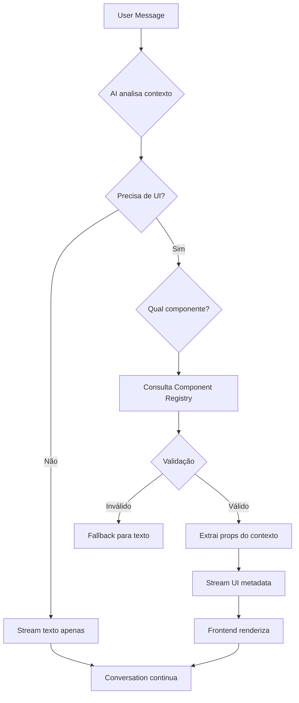

# Arquitetura de Generative UI para Sirius CRM
## Sistema de Interface Fluida e Adaptativa para Vendas Conversacionais

**Versão:** 1.0
**Data:** 2026-01-31
**Projeto:** Sirius CRM - AGI Sales Intelligence
**Autor:** Arquitetura baseada em Capítulo 5 - Generative UI

---

## 📑 Índice

1. [Visão Geral](#1-visão-geral)
2. [Estado Atual do Sistema](#2-estado-atual-do-sistema)
3. [Arquitetura de Generative UI](#3-arquitetura-de-generative-ui)
4. [Component Registry](#4-component-registry)
5. [Protocolo de Comunicação](#5-protocolo-de-comunicação)
6. [Fluxo de Streaming](#6-fluxo-de-streaming)
7. [Casos de Uso](#7-casos-de-uso)
8. [Roadmap de Implementação](#8-roadmap-de-implementação)
9. [Considerações Técnicas](#9-considerações-técnicas)
10. [Apêndices](#10-apêndices)

---

## 1. Visão Geral

### 1.1 O que é Generative UI?

Generative UI não é apenas sobre renderizar componentes - é sobre criar uma interface fluida que se adapta à narrativa da venda. O agente AI atua como um **"orquestrador de UI"**, decidindo qual componente visual melhor apoia o ponto que está tentando fazer.

**Diferença Fundamental:**

| Chat Tradicional | Generative UI |
|-----------------|---------------|
| User: "Como calcular ROI?" | User: "Como calcular ROI?" |
| AI: "Use esta fórmula: (Receita - Custo) / Custo" | AI (texto): "Deixa eu te mostrar:" |
| | AI (ação): *renderiza `<ROICalculator />`* |
| | AI (texto): "Coloca os valores aqui ↑" |

### 1.2 Objetivos do Sistema

1. **Aumentar conversão** através de interfaces interativas contextuais
2. **Reduzir fricção** na jornada de vendas com automação inteligente
3. **Manter consistência** visual usando Design System validado
4. **Garantir acessibilidade** via componentes Radix UI
5. **Escalar personalização** sem aumentar complexidade de código

### 1.3 Princípios de Design

- **Declarativo, não imperativo**: AI declara intenção (`<ROICalculator />`), não gera HTML
- **Componentes reutilizáveis**: Biblioteca fixa de componentes validados
- **Context-aware**: Componentes recebem dados extraídos da conversa
- **Streaming-first**: UI renderiza progressivamente durante resposta
- **Feedback visual**: Skeletons, loaders, estados otimistas

---

## 2. Estado Atual do Sistema

### 2.1 AGI Sirius - Fundação Existente

O Sirius CRM já possui uma base AI robusta:

**Componentes Implementados:**

```
lib/agi/
├── brain.ts                 # LLM abstraction (Groq, OpenAI, Ollama)
├── spin-engine.ts           # SPIN Selling methodology
├── sandler-prompts.ts       # Sandler framework
├── guardrails.ts            # Safety, hallucination detection
├── skills.ts                # BANT, MEDDIC, objection handling
└── types.ts                 # TypeScript definitions
```

**API Endpoints:**

```typescript
POST /api/agi/chat              // Chat conversacional
POST /api/agi/generate-script   // Geração de scripts
POST /api/agi/analyze-deal      // Análise de deals
POST /api/agi/insights          // Geração de insights
POST /api/agi/diagnostic        // Diagnóstico de leads
POST /api/graph/rag             // Knowledge graph queries
```

**UI Existente:**

- `components/agi/AgiChatSidebar.tsx` - Chat sidebar flutuante
- Integrado no dashboard com contexto de deals
- Streaming de respostas (texto apenas)

**Database Schema:**

```prisma
model AgiConversation {
  id            String   @id @default(cuid())
  userId        String
  organizationId String
  messages      Json     // Array de mensagens
  tokensUsed    Int      @default(0)
  context       Json?    // Deal/pipeline context
  dealId        String?
  createdAt     DateTime @default(now())
}

model ConversationSession {
  id                   String   @id @default(cuid())
  conversationId       String
  spinState            String?  // SPIN stage atual
  sandlerStage         String?  // Sandler stage
  qualificationScore   Float?   // BANT/MEDDIC score
  metadata             Json?
}
```

### 2.2 Limitações Atuais

**O que NÃO existe:**

❌ Renderização dinâmica de componentes UI
❌ Component Registry para AI
❌ Streaming com UI metadata
❌ Componentes interativos inline (calculadoras, forms, etc.)
❌ Sistema de feedback visual avançado (skeletons específicos)
❌ Cache de componentes gerados

**O que vamos adicionar:**

✅ Component Registry declarativo
✅ AI Tool para `render_ui_component`
✅ Streaming com chunks de UI
✅ Dynamic Component Renderer
✅ Biblioteca de componentes de vendas (ROI Calc, Pricing, etc.)
✅ Sistema de skeletons contextuais

---

## 3. Arquitetura de Generative UI

### 3.1 Visão Geral da Arquitetura

```
┌─────────────────────────────────────────────────────────────┐
│                    USER INTERFACE                            │
│  ┌──────────────────────────────────────────────────────┐   │
│  │  ChatContainer                                        │   │
│  │  ├─ MessageRenderer                                   │   │
│  │  │  ├─ Text Chunks (Markdown)                        │   │
│  │  │  ├─ UI Component Chunks (Dynamic)                 │   │
│  │  │  └─ Thinking Indicators                           │   │
│  │  └─ DynamicUIComponent (lazy loading)                │   │
│  └──────────────────────────────────────────────────────┘   │
└─────────────────────────────────────────────────────────────┘
                             ▲
                             │ Streaming Response
                             │ (text + ui_component chunks)
                             ▼
┌─────────────────────────────────────────────────────────────┐
│                    API LAYER                                 │
│  POST /api/agi/chat-with-ui                                 │
│  ├─ Extract context from conversation                       │
│  ├─ Call AGI Brain (LLM)                                    │
│  ├─ Parse AI response for UI intent                         │
│  ├─ Validate component + props (Component Registry)         │
│  └─ Stream: { type: 'text' | 'ui_component' | 'thinking' } │
└─────────────────────────────────────────────────────────────┘
                             ▲
                             │ Component Metadata
                             ▼
┌─────────────────────────────────────────────────────────────┐
│              COMPONENT REGISTRY                              │
│  {                                                           │
│    ROICalculator: {                                         │
│      description: "Interactive ROI calculator",             │
│      when_to_use: [...conditions],                          │
│      required_context: ['monthly_volume'],                  │
│      render: (props) => <ROICalculator {...props} />        │
│    },                                                        │
│    ...                                                       │
│  }                                                           │
└─────────────────────────────────────────────────────────────┘
                             ▲
                             │ Schema Validation
                             ▼
┌─────────────────────────────────────────────────────────────┐
│                  AGI BRAIN (LLM)                            │
│  ├─ System Prompt com Component Registry                    │
│  ├─ Tool: render_ui_component(name, props, reasoning)      │
│  ├─ Context: conversation history + deal data               │
│  └─ Decision: quando/qual componente renderizar             │
└─────────────────────────────────────────────────────────────┘
```

### 3.2 Fluxo de Decisão do AI



### 3.3 Camadas do Sistema

#### Layer 1: Component Registry (Declaração)
Define quais componentes estão disponíveis para o AI.

#### Layer 2: AI Decision Engine (Orquestração)
AI decide quando e qual componente usar baseado em:
- Contexto da conversa
- Estágio SPIN/Sandler
- Lead score
- Tipo de pergunta

#### Layer 3: Streaming Protocol (Transporte)
Protocolo de comunicação entre backend e frontend.

#### Layer 4: Dynamic Renderer (Apresentação)
Frontend renderiza componentes dinamicamente com lazy loading.

---

## 4. Component Registry

### 4.1 Estrutura do Registry

```typescript
// lib/generative-ui/component-registry.ts

import { z } from 'zod'
import { ComponentType } from 'react'

export interface ComponentDefinition {
  name: string
  description: string
  when_to_use: string[]
  required_context: string[]
  optional_context?: string[]
  props_schema: z.ZodSchema
  render: ComponentType<any>
  skeleton?: {
    height: number
    variant: string
  }
  triggers_event?: string // Ex: 'demo_scheduled', 'roi_calculated'
  example?: {
    scenario: string
    invocation: Record<string, any>
  }
}

export const SALES_UI_COMPONENTS: Record<string, ComponentDefinition> = {
  // Definições completas na próxima seção
}
```

### 4.2 Componentes de Vendas

#### 4.2.1 ROICalculator

**Propósito:** Calculadora interativa de ROI para demonstrar valor do Sirius CRM.

**Quando usar:**
- Usuário questiona custo/investimento
- Lead score > 50 (interesse em pricing)
- Contexto de comparação com concorrentes
- Fase de "Implication" no SPIN

**Schema:**

```typescript
const ROICalculatorPropsSchema = z.object({
  scenario: z.object({
    currentCost: z.number().positive(),
    withSirius: z.number().positive(),
    monthlySavings: z.number(),
    annualROI: z.number(),
    paybackPeriod: z.number(), // em meses
  }),
  industry: z.enum(['orthodontics', 'retail', 'services', 'manufacturing']).optional(),
  comparisonMode: z.boolean().default(false), // Mostra comparação antes/depois
})
```

**Exemplo de invocação:**

```json
{
  "component_name": "ROICalculator",
  "props": {
    "scenario": {
      "currentCost": 15000,
      "withSirius": 8000,
      "monthlySavings": 7000,
      "annualROI": 84000,
      "paybackPeriod": 2
    },
    "industry": "orthodontics",
    "comparisonMode": true
  },
  "reasoning": "User mentioned spending R$15k/month on current CRM + manual processes"
}
```

---

#### 4.2.2 DealFormGenerator

**Propósito:** Gera formulário de criação de deal dinamicamente baseado no contexto.

**Quando usar:**
- Usuário está qualificado (BANT completo)
- Contexto de criar oportunidade
- Após demo bem-sucedida
- Lead score > 70

**Schema:**

```typescript
const DealFormGeneratorPropsSchema = z.object({
  prefill: z.object({
    title: z.string().optional(),
    value: z.number().optional(),
    closeDate: z.string().optional(), // ISO date
    contactId: z.string().optional(),
    pipelineId: z.string().optional(),
    stageId: z.string().optional(),
  }),
  suggestedTags: z.array(z.string()).optional(),
  aiNotes: z.string().optional(), // Insights do AI para pré-preencher notas
  quickCreate: z.boolean().default(false), // Modo simplificado
})
```

**Comportamento:**
- Preenche campos automaticamente com dados extraídos da conversa
- Sugere tags baseado em palavras-chave mencionadas
- Adiciona nota automática com resumo da conversa
- Permite edição antes de salvar

---

#### 4.2.3 PricingComparison

**Propósito:** Tabela comparativa de planos (FREE vs PRO) com highlighting contextual.

**Quando usar:**
- Usuário pergunta sobre preços
- Fase de "Need-Payoff" no SPIN
- Objeção de custo
- Comparação com concorrentes

**Schema:**

```typescript
const PricingComparisonPropsSchema = z.object({
  highlighted: z.enum(['free', 'pro']),
  emphasize_features: z.array(z.string()).optional(), // Ex: ['api_access', 'unlimited_contacts']
  show_roi_badge: z.boolean().default(false),
  annual_savings: z.number().optional(), // Mostra economia anual no PRO
})
```

---

#### 4.2.4 ScriptPreview

**Propósito:** Preview de script gerado com opções de edição e cópia.

**Quando usar:**
- Após gerar script (cold call, email, follow-up)
- Usuário solicita ajuda com abordagem
- Contexto de preparação de prospecção

**Schema:**

```typescript
const ScriptPreviewPropsSchema = z.object({
  scriptType: z.enum(['cold_call', 'cold_email', 'follow_up', 'demo_pitch', 'objection_handling']),
  content: z.string(),
  metadata: z.object({
    targetRole: z.string().optional(), // Ex: "CEO de clínica"
    painPoints: z.array(z.string()).optional(),
    valueProps: z.array(z.string()).optional(),
  }),
  editable: z.boolean().default(true),
  showCopyButton: z.boolean().default(true),
})
```

---

#### 4.2.5 DemoScheduler

**Propósito:** Calendly embed para agendamento de demos.

**Quando usar:**
- Lead score > 80
- BANT completo
- Usuário expressa interesse em ver demo
- Fase final de SPIN (Need-Payoff)

**Schema:**

```typescript
const DemoSchedulerPropsSchema = z.object({
  eventType: z.enum(['demo_30min', 'demo_60min', 'onboarding_call']),
  prefill: z.object({
    name: z.string().optional(),
    email: z.string().email().optional(),
    company: z.string().optional(),
  }),
  autoTriggerCRM: z.boolean().default(true), // Cria deal automaticamente ao agendar
})
```

**Triggers:**
- Evento CRM: `demo_scheduled`
- Cria deal automaticamente no pipeline
- Envia email de confirmação

---

#### 4.2.6 QualificationDashboard

**Propósito:** Dashboard visual do score de qualificação (BANT/MEDDIC).

**Quando usar:**
- Após diagnóstico completo
- Usuário questiona "Sirius é pra mim?"
- Fase de "Problem" no SPIN

**Schema:**

```typescript
const QualificationDashboardPropsSchema = z.object({
  scores: z.object({
    budget: z.number().min(0).max(100),
    authority: z.number().min(0).max(100),
    need: z.number().min(0).max(100),
    timeline: z.number().min(0).max(100),
  }),
  overall: z.number().min(0).max(100),
  recommendations: z.array(z.string()),
  nextSteps: z.array(z.string()),
})
```

---

#### 4.2.7 CompetitorMatrix

**Propósito:** Matriz comparativa Sirius vs Concorrentes.

**Quando usar:**
- Usuário menciona concorrente (Pipedrive, RD Station, HubSpot)
- Fase de consideração
- Objeção de "preciso avaliar outras opções"

**Schema:**

```typescript
const CompetitorMatrixPropsSchema = z.object({
  competitors: z.array(z.enum(['pipedrive', 'rdstation', 'hubspot', 'salesforce'])),
  focusFeatures: z.array(z.string()).optional(), // Features a destacar
  showPricing: z.boolean().default(true),
})
```

---

#### 4.2.8 OnboardingTimeline

**Propósito:** Timeline visual de implementação do Sirius.

**Quando usar:**
- Usuário pergunta "quanto tempo leva?"
- Objeção de complexidade de setup
- Após lead qualificado (score > 70)

**Schema:**

```typescript
const OnboardingTimelinePropsSchema = z.object({
  plan: z.enum(['free', 'pro']),
  teamSize: z.enum(['solo', 'small', 'medium', 'large']),
  hasIntegrations: z.boolean().default(false),
  estimatedDays: z.number(),
})
```

---

#### 4.2.9 InsightCard

**Propósito:** Card de insight/recomendação do AI.

**Quando usar:**
- Após análise de deal
- Sugestões de próximos passos
- Alertas de oportunidades

**Schema:**

```typescript
const InsightCardPropsSchema = z.object({
  type: z.enum(['opportunity', 'risk', 'recommendation', 'alert']),
  title: z.string(),
  description: z.string(),
  confidence: z.number().min(0).max(1),
  actions: z.array(z.object({
    label: z.string(),
    action: z.enum(['create_deal', 'schedule_demo', 'send_email', 'add_note']),
    params: z.record(z.any()).optional(),
  })).optional(),
})
```

---

#### 4.2.10 EmailPreview

**Propósito:** Preview de email de automação com editor inline.

**Quando usar:**
- Configuração de automações
- Usuário quer personalizar templates
- Preview antes de ativar automation

**Schema:**

```typescript
const EmailPreviewPropsSchema = z.object({
  template: z.object({
    subject: z.string(),
    body: z.string(), // HTML ou Markdown
    variables: z.record(z.string()).optional(), // {contact_name: "João"}
  }),
  testMode: z.boolean().default(false),
})
```

---

### 4.3 Registry Completo (Código)

```typescript
// lib/generative-ui/component-registry.ts

import { ROICalculator } from '@/components/generative-ui/ROICalculator'
import { DealFormGenerator } from '@/components/generative-ui/DealFormGenerator'
import { PricingComparison } from '@/components/generative-ui/PricingComparison'
import { ScriptPreview } from '@/components/generative-ui/ScriptPreview'
import { DemoScheduler } from '@/components/generative-ui/DemoScheduler'
import { QualificationDashboard } from '@/components/generative-ui/QualificationDashboard'
import { CompetitorMatrix } from '@/components/generative-ui/CompetitorMatrix'
import { OnboardingTimeline } from '@/components/generative-ui/OnboardingTimeline'
import { InsightCard } from '@/components/generative-ui/InsightCard'
import { EmailPreview } from '@/components/generative-ui/EmailPreview'

export const SALES_UI_COMPONENTS: Record<string, ComponentDefinition> = {
  ROICalculator: {
    name: 'ROICalculator',
    description: 'Calculadora interativa de ROI para demonstrar valor do Sirius CRM',
    when_to_use: [
      'usuário questiona custo ou investimento',
      'lead score > 50 (interesse em pricing)',
      'contexto de comparação com concorrentes',
      'fase de "Implication" no SPIN',
    ],
    required_context: ['currentCost', 'estimatedSavings'],
    optional_context: ['industry', 'teamSize'],
    props_schema: ROICalculatorPropsSchema,
    render: ROICalculator,
    skeleton: { height: 400, variant: 'calculator' },
    triggers_event: 'roi_calculated',
    example: {
      scenario: 'Lead menciona gastar R$15k/mês em CRM atual + processos manuais',
      invocation: {
        scenario: {
          currentCost: 15000,
          withSirius: 8000,
          monthlySavings: 7000,
          annualROI: 84000,
          paybackPeriod: 2,
        },
        industry: 'orthodontics',
        comparisonMode: true,
      },
    },
  },

  DealFormGenerator: {
    name: 'DealFormGenerator',
    description: 'Formulário de criação de deal com dados pré-preenchidos',
    when_to_use: [
      'usuário está qualificado (BANT completo)',
      'contexto de criar oportunidade',
      'após demo bem-sucedida',
      'lead score > 70',
    ],
    required_context: [],
    optional_context: ['contactName', 'dealValue', 'closeDate', 'conversationSummary'],
    props_schema: DealFormGeneratorPropsSchema,
    render: DealFormGenerator,
    skeleton: { height: 500, variant: 'form' },
    triggers_event: 'deal_created',
  },

  PricingComparison: {
    name: 'PricingComparison',
    description: 'Tabela comparativa de planos FREE vs PRO',
    when_to_use: [
      'usuário pergunta sobre preços',
      'fase de "Need-Payoff" no SPIN',
      'objeção de custo',
      'comparação com concorrentes',
    ],
    required_context: [],
    optional_context: ['userPlan', 'annualSavings'],
    props_schema: PricingComparisonPropsSchema,
    render: PricingComparison,
    skeleton: { height: 600, variant: 'table' },
  },

  ScriptPreview: {
    name: 'ScriptPreview',
    description: 'Preview de script gerado com opções de edição',
    when_to_use: [
      'após gerar script via /api/agi/generate-script',
      'usuário solicita ajuda com abordagem',
      'contexto de preparação de prospecção',
    ],
    required_context: ['scriptType', 'scriptContent'],
    optional_context: ['targetRole', 'painPoints'],
    props_schema: ScriptPreviewPropsSchema,
    render: ScriptPreview,
    skeleton: { height: 350, variant: 'text' },
    triggers_event: 'script_copied',
  },

  DemoScheduler: {
    name: 'DemoScheduler',
    description: 'Agendador de demos via Calendly',
    when_to_use: [
      'lead score > 80',
      'BANT completo',
      'usuário expressa interesse em ver demo',
      'fase final de SPIN (Need-Payoff)',
    ],
    required_context: [],
    optional_context: ['contactName', 'contactEmail', 'company'],
    props_schema: DemoSchedulerPropsSchema,
    render: DemoScheduler,
    skeleton: { height: 700, variant: 'iframe' },
    triggers_event: 'demo_scheduled',
  },

  QualificationDashboard: {
    name: 'QualificationDashboard',
    description: 'Dashboard visual de score BANT/MEDDIC',
    when_to_use: [
      'após diagnóstico completo',
      'usuário questiona fit do produto',
      'fase de "Problem" no SPIN',
    ],
    required_context: ['bantScores', 'overallScore'],
    props_schema: QualificationDashboardPropsSchema,
    render: QualificationDashboard,
    skeleton: { height: 450, variant: 'dashboard' },
  },

  CompetitorMatrix: {
    name: 'CompetitorMatrix',
    description: 'Matriz comparativa Sirius vs Concorrentes',
    when_to_use: [
      'usuário menciona concorrente específico',
      'fase de consideração',
      'objeção de "preciso avaliar outras opções"',
    ],
    required_context: ['competitors'],
    optional_context: ['focusFeatures'],
    props_schema: CompetitorMatrixPropsSchema,
    render: CompetitorMatrix,
    skeleton: { height: 500, variant: 'table' },
  },

  OnboardingTimeline: {
    name: 'OnboardingTimeline',
    description: 'Timeline de implementação do Sirius',
    when_to_use: [
      'usuário pergunta "quanto tempo leva?"',
      'objeção de complexidade de setup',
      'após lead qualificado (score > 70)',
    ],
    required_context: ['plan'],
    optional_context: ['teamSize', 'hasIntegrations'],
    props_schema: OnboardingTimelinePropsSchema,
    render: OnboardingTimeline,
    skeleton: { height: 400, variant: 'timeline' },
  },

  InsightCard: {
    name: 'InsightCard',
    description: 'Card de insight/recomendação do AI',
    when_to_use: [
      'após análise de deal',
      'sugestões de próximos passos',
      'alertas de oportunidades',
    ],
    required_context: ['insightType', 'title', 'description'],
    optional_context: ['actions'],
    props_schema: InsightCardPropsSchema,
    render: InsightCard,
    skeleton: { height: 200, variant: 'card' },
  },

  EmailPreview: {
    name: 'EmailPreview',
    description: 'Preview de email com editor inline',
    when_to_use: [
      'configuração de automações',
      'usuário quer personalizar templates',
      'preview antes de ativar automation',
    ],
    required_context: ['emailTemplate'],
    props_schema: EmailPreviewPropsSchema,
    render: EmailPreview,
    skeleton: { height: 500, variant: 'email' },
  },
}

// Helper: Validar props antes de renderizar
export function validateComponentProps(
  componentName: string,
  props: unknown
): { valid: boolean; error?: string; data?: any } {
  const component = SALES_UI_COMPONENTS[componentName]

  if (!component) {
    return { valid: false, error: `Component "${componentName}" not found in registry` }
  }

  const result = component.props_schema.safeParse(props)

  if (!result.success) {
    return { valid: false, error: result.error.message }
  }

  return { valid: true, data: result.data }
}

// Helper: Obter componentes disponíveis para o AI
export function getComponentsForAI() {
  return Object.entries(SALES_UI_COMPONENTS).map(([name, def]) => ({
    name,
    description: def.description,
    when_to_use: def.when_to_use,
    required_context: def.required_context,
    optional_context: def.optional_context,
  }))
}
```

---

## 5. Protocolo de Comunicação

### 5.1 AI Tool Definition

O AGI Brain precisa de uma nova ferramenta para invocar UI:

```typescript
// lib/agi/tools/render-ui-tool.ts

import { z } from 'zod'
import { SALES_UI_COMPONENTS } from '@/lib/generative-ui/component-registry'

export const renderUIComponentTool = {
  name: 'render_ui_component',
  description: `Renderiza um componente visual para apoiar o argumento de venda.

Use esta ferramenta quando:
- Uma demonstração visual ajudaria a explicar conceitos
- O usuário precisa de uma ferramenta interativa (calculadora, formulário)
- Dados podem ser melhor apresentados visualmente
- Você quer facilitar uma ação (agendar demo, criar deal)

Componentes disponíveis:
${Object.keys(SALES_UI_COMPONENTS).join(', ')}`,

  parameters: z.object({
    component_name: z
      .enum(Object.keys(SALES_UI_COMPONENTS) as [string, ...string[]])
      .describe('Nome do componente a renderizar'),

    props: z
      .record(z.any())
      .describe('Dados extraídos da conversa para popular o componente'),

    reasoning: z
      .string()
      .describe('Por que esse componente ajuda neste momento da venda'),

    position: z
      .enum(['before_text', 'after_text', 'replace_text'])
      .default('after_text')
      .describe('Onde renderizar em relação ao texto da resposta'),
  }),

  execute: async ({ component_name, props, reasoning, position }) => {
    // Validação
    const validation = validateComponentProps(component_name, props)

    if (!validation.valid) {
      return {
        success: false,
        error: validation.error,
      }
    }

    // Retorna metadata para streaming
    return {
      success: true,
      ui_metadata: {
        type: 'ui_component',
        name: component_name,
        props: validation.data,
        reasoning,
        position,
        skeleton: SALES_UI_COMPONENTS[component_name].skeleton,
      },
    }
  },
}
```

### 5.2 System Prompt Addition

Adicionar ao system prompt do AGI:

```typescript
const GENERATIVE_UI_SYSTEM_PROMPT = `
# Generative UI Capabilities

Você tem acesso a componentes visuais interativos para enriquecer suas respostas.

## Quando usar componentes UI:

1. **ROICalculator** - Quando usuário questionar custo, ROI, economia
2. **DealFormGenerator** - Quando usuário estiver pronto para criar oportunidade (BANT completo)
3. **PricingComparison** - Quando discutir planos ou comparar com concorrentes
4. **ScriptPreview** - Após gerar scripts de prospecção
5. **DemoScheduler** - Quando lead score > 80 e usuário mostrar interesse em demo
6. **QualificationDashboard** - Após diagnóstico completo do lead
7. **CompetitorMatrix** - Quando usuário mencionar concorrentes
8. **OnboardingTimeline** - Quando usuário perguntar sobre tempo de implementação
9. **InsightCard** - Para destacar insights importantes
10. **EmailPreview** - Ao configurar automações de email

## Regras importantes:

- SEMPRE extraia dados do contexto da conversa para preencher props
- NÃO invente dados - use apenas informações confirmadas pelo usuário
- Explique o componente antes de renderizá-lo ("Deixa eu te mostrar...")
- Use componentes para APOIAR o argumento, não substituir explicação
- Um componente por resposta (evite sobrecarga visual)
- Se não tiver dados suficientes, pergunte antes de renderizar

## Exemplo de uso correto:

User: "Quanto eu economizo com o Sirius?"
Assistant: "Ótima pergunta! Baseado no que você me contou (R$15k/mês em CRM + processos manuais), deixa eu calcular o ROI pra você:"
[Chama render_ui_component com ROICalculator]
Assistant: "Como você pode ver acima ↑, a economia anual seria de R$84mil. Quer que eu detalhe como chegamos nesses números?"
`
```

### 5.3 Response Format

**Streaming chunks:**

```typescript
type StreamChunk =
  | { type: 'text'; content: string }
  | { type: 'ui_component'; name: string; props: Record<string, any>; skeleton: SkeletonConfig }
  | { type: 'thinking'; state: ThinkingState }
  | { type: 'error'; message: string }

// Exemplo de stream:
[
  { type: 'text', content: 'Deixa eu te mostrar como funciona:' },
  {
    type: 'ui_component',
    name: 'ROICalculator',
    props: { scenario: {...}, industry: 'orthodontics' },
    skeleton: { height: 400, variant: 'calculator' }
  },
  { type: 'text', content: 'Agora testa aí com seus números reais ↑' }
]
```

---

## 6. Fluxo de Streaming

### 6.1 Backend Implementation

```typescript
// app/api/agi/chat-with-ui/route.ts

import { streamText } from 'ai'
import { createGroq } from '@ai-sdk/groq'
import { renderUIComponentTool } from '@/lib/agi/tools/render-ui-tool'
import { getConversationContext } from '@/lib/agi/context'

export async function POST(req: Request) {
  const { messages, dealId, userId, organizationId } = await req.json()

  // 1. Carregar contexto
  const context = await getConversationContext({ dealId, userId, organizationId })

  // 2. Preparar LLM com tools
  const groq = createGroq({
    apiKey: process.env.GROQ_API_KEY!,
  })

  // 3. Stream com UI support
  const result = await streamText({
    model: groq('llama-3.3-70b-versatile'),
    system: SYSTEM_PROMPT + GENERATIVE_UI_SYSTEM_PROMPT,
    messages,
    tools: {
      render_ui_component: renderUIComponentTool,
      // ... outras tools existentes
    },
    onFinish: async ({ usage, finishReason }) => {
      // Salvar conversa
      await saveConversation({
        userId,
        organizationId,
        messages,
        tokensUsed: usage.totalTokens,
      })
    },
  })

  // 4. Transform stream para incluir UI metadata
  const transformedStream = result.toDataStream({
    transform: async (chunk, controller) => {
      // Chunk de texto normal
      if (chunk.type === 'text-delta') {
        controller.enqueue({ type: 'text', content: chunk.textDelta })
      }

      // Tool call (UI component)
      if (chunk.type === 'tool-call' && chunk.toolName === 'render_ui_component') {
        const toolResult = await renderUIComponentTool.execute(chunk.args)

        if (toolResult.success) {
          controller.enqueue(toolResult.ui_metadata)
        } else {
          controller.enqueue({ type: 'error', message: toolResult.error })
        }
      }

      // Thinking state
      if (chunk.type === 'step-start') {
        controller.enqueue({
          type: 'thinking',
          state: inferThinkingState(chunk.stepType)
        })
      }
    },
  })

  return new Response(transformedStream, {
    headers: {
      'Content-Type': 'text/event-stream',
      'Cache-Control': 'no-cache',
      'Connection': 'keep-alive',
    },
  })
}

function inferThinkingState(stepType: string): ThinkingState {
  const stateMap: Record<string, ThinkingState> = {
    'tool-call-render_ui_component': 'generating_ui',
    'tool-call-analyze_deal': 'analyzing_deal',
    'retrieval': 'querying_knowledge',
  }
  return stateMap[stepType] || 'thinking'
}
```

### 6.2 Frontend Stream Consumer

```typescript
// components/agi/ChatWithUI.tsx

'use client'

import { useChat } from '@ai-sdk/react'
import { DynamicUIComponent } from '@/components/generative-ui/DynamicUIComponent'
import { ThinkingIndicator } from '@/components/agi/ThinkingIndicator'
import { Skeleton } from '@/components/ui/skeleton'

export function ChatWithUI({ dealId }: { dealId?: string }) {
  const { messages, input, handleInputChange, handleSubmit, isLoading } = useChat({
    api: '/api/agi/chat-with-ui',
    body: { dealId },

    // Processar streaming customizado
    experimental_prepareRequestBody: ({ messages }) => ({
      messages,
      dealId,
    }),
  })

  return (
    <div className="flex flex-col h-full">
      {/* Messages */}
      <div className="flex-1 overflow-y-auto space-y-4 p-4">
        {messages.map((message) => (
          <MessageRenderer key={message.id} message={message} />
        ))}

        {isLoading && <ThinkingIndicator state="thinking" />}
      </div>

      {/* Input */}
      <form onSubmit={handleSubmit} className="p-4 border-t">
        <input
          value={input}
          onChange={handleInputChange}
          placeholder="Pergunte algo sobre vendas..."
          className="w-full p-2 border rounded"
        />
      </form>
    </div>
  )
}

function MessageRenderer({ message }: { message: Message }) {
  // Parse message content para detectar UI components
  const chunks = parseMessageChunks(message.content)

  return (
    <div className="message">
      {chunks.map((chunk, i) => {
        switch (chunk.type) {
          case 'text':
            return <Markdown key={i}>{chunk.content}</Markdown>

          case 'ui_component':
            return (
              <Suspense
                key={i}
                fallback={<ComponentSkeleton {...chunk.skeleton} />}
              >
                <DynamicUIComponent
                  name={chunk.name}
                  props={chunk.props}
                  onInteraction={(data) => {
                    // Track interaction
                    analytics.track('genui_interaction', {
                      component: chunk.name,
                      data,
                    })
                  }}
                />
              </Suspense>
            )

          case 'thinking':
            return <ThinkingIndicator key={i} state={chunk.state} />
        }
      })}
    </div>
  )
}
```

### 6.3 Dynamic Component Loader

```typescript
// components/generative-ui/DynamicUIComponent.tsx

'use client'

import { lazy, Suspense } from 'react'
import { SALES_UI_COMPONENTS } from '@/lib/generative-ui/component-registry'
import { ComponentSkeleton } from './ComponentSkeleton'

interface DynamicUIComponentProps {
  name: string
  props: Record<string, any>
  onInteraction?: (data: any) => void
}

export function DynamicUIComponent({ name, props, onInteraction }: DynamicUIComponentProps) {
  const componentDef = SALES_UI_COMPONENTS[name]

  if (!componentDef) {
    return (
      <div className="p-4 border border-red-500 rounded">
        Erro: Componente "{name}" não encontrado.
      </div>
    )
  }

  // Validação de props
  const validation = componentDef.props_schema.safeParse(props)

  if (!validation.success) {
    return (
      <div className="p-4 border border-yellow-500 rounded">
        Erro de validação: {validation.error.message}
      </div>
    )
  }

  const Component = componentDef.render

  return (
    <div className="genui-component my-4">
      <Component
        {...validation.data}
        onInteraction={onInteraction}
      />
    </div>
  )
}
```

### 6.4 Skeleton Components

```typescript
// components/generative-ui/ComponentSkeleton.tsx

import { Skeleton } from '@/components/ui/skeleton'

interface ComponentSkeletonProps {
  height: number
  variant: 'calculator' | 'form' | 'table' | 'dashboard' | 'timeline' | 'card' | 'email' | 'iframe' | 'text'
}

export function ComponentSkeleton({ height, variant }: ComponentSkeletonProps) {
  const variants = {
    calculator: (
      <div className="space-y-4 p-6 border rounded-lg" style={{ height }}>
        <Skeleton className="h-8 w-1/2" />
        <Skeleton className="h-12 w-full" />
        <Skeleton className="h-12 w-full" />
        <Skeleton className="h-20 w-full" />
        <Skeleton className="h-10 w-32 ml-auto" />
      </div>
    ),
    form: (
      <div className="space-y-4 p-6 border rounded-lg" style={{ height }}>
        <Skeleton className="h-10 w-full" />
        <Skeleton className="h-10 w-full" />
        <Skeleton className="h-24 w-full" />
        <Skeleton className="h-10 w-40" />
      </div>
    ),
    table: (
      <div className="space-y-2 p-6 border rounded-lg" style={{ height }}>
        <Skeleton className="h-12 w-full" />
        <Skeleton className="h-10 w-full" />
        <Skeleton className="h-10 w-full" />
        <Skeleton className="h-10 w-full" />
      </div>
    ),
    // ... outros variants
  }

  return variants[variant] || <Skeleton style={{ height }} className="w-full rounded-lg" />
}
```

---

## 7. Casos de Uso

### 7.1 Caso de Uso 1: ROI Calculator

**Cenário:**
Lead está no estágio de "Implication" do SPIN. Já identificamos o problema (processos manuais caros), agora precisamos quantificar o impacto.

**Conversa:**

```
User: "Tô gastando muito com meu CRM atual e ainda preciso de gente pra fazer tudo manual. Quanto eu economizaria com o Sirius?"

AI (texto): "Entendo perfeitamente. Deixa eu calcular o ROI baseado no que você me contou:"

AI (thinking): "Consultando dados do setor..."

AI (ui_component): [Renderiza ROICalculator]
  - Props extraídos:
    - currentCost: 15000 (mencionado na conversa anterior)
    - withSirius: 8000 (calculado: plano PRO + estimativa de redução de horas)
    - monthlySavings: 7000
    - annualROI: 84000
    - paybackPeriod: 2 meses

AI (texto): "Como você pode ver acima ↑, considerando seu volume atual e o plano PRO, você economizaria R$7mil/mês. O investimento se paga em menos de 2 meses. Quer que eu detalhe como chegamos nesses números?"
```

**Resultado:**
- Lead visualiza concretamente o valor
- Pode ajustar números na calculadora interativamente
- AI captura ajustes e atualiza argumentação
- Reduz objeção de preço

---

### 7.2 Caso de Uso 2: Deal Form Generator

**Cenário:**
Lead passou por diagnóstico completo (BANT verificado), demo foi bem-sucedida, agora é hora de criar a oportunidade.

**Conversa:**

```
User: "Gostei da demo! Como faço pra começar?"

AI (texto): "Excelente! Vou criar uma oportunidade no seu pipeline. Já preenchi os dados que conversamos:"

AI (ui_component): [Renderiza DealFormGenerator]
  - Props extraídos:
    - prefill.title: "Implementação Sirius CRM - Clínica Odonto Excellence"
    - prefill.value: 12000 (estimado baseado em conversas)
    - prefill.closeDate: "2026-03-15" (timeline mencionado: 45 dias)
    - suggestedTags: ["ortodontia", "high-value", "demo-realizada"]
    - aiNotes: "Lead qualificado. BANT completo. Pain points: processos manuais, falta de visibilidade de funil. Demonstrou interesse em integração com WhatsApp."

AI (texto): "Confere se tá tudo certo aí ↑. Você pode ajustar qualquer campo antes de criar."
```

**Resultado:**
- Reduz fricção (dados já preenchidos)
- Lead só confirma e ajusta
- AI notes preservam contexto
- Deal criado em segundos

---

### 7.3 Caso de Uso 3: Demo Scheduler

**Cenário:**
Lead altamente qualificado (score > 85), BANT completo, está pronto para demo.

**Conversa:**

```
User: "Quero ver como funciona na prática. Tem como agendar uma demo?"

AI (texto): "Com certeza! Vou abrir a agenda para você escolher o melhor horário:"

AI (ui_component): [Renderiza DemoScheduler]
  - Props extraídos:
    - eventType: "demo_60min" (lead qualificado merece demo completa)
    - prefill.name: "Dr. João Silva"
    - prefill.email: "joao@clinicaexcellence.com"
    - prefill.company: "Clínica Odonto Excellence"
    - autoTriggerCRM: true

AI (texto): "Escolhe aí o horário que funciona melhor pra você ↑. Assim que confirmar, já criamos a oportunidade no pipeline e você recebe os detalhes por email."
```

**Resultado:**
- Agendamento sem sair do chat
- Deal criado automaticamente
- Email de confirmação enviado
- Calendário sincronizado

---

### 7.4 Caso de Uso 4: Qualification Dashboard

**Cenário:**
Lead completou diagnóstico express, AI fez análise BANT.

**Conversa:**

```
User: "O Sirius realmente faz sentido pro meu negócio?"

AI (texto): "Ótima pergunta! Fiz uma análise baseada no que você me contou. Olha só:"

AI (ui_component): [Renderiza QualificationDashboard]
  - Props:
    - scores: { budget: 85, authority: 100, need: 90, timeline: 70 }
    - overall: 86
    - recommendations: [
      "Você tem budget e autoridade para decisão ✓",
      "Necessidade clara identificada (redução de processos manuais) ✓",
      "Timeline de 2-3 meses é ideal para implementação",
    ]
    - nextSteps: [
      "Agendar demo completa (60min)",
      "Validar integrações necessárias (WhatsApp, Google Calendar)",
      "Definir equipe de implementação",
    ]

AI (texto): "Seu fit score é 86/100 - você se encaixa perfeitamente no perfil de clientes que mais têm sucesso com o Sirius! Os próximos passos sugeridos estão ali em cima ↑. Quer que eu te ajude com algum deles?"
```

**Resultado:**
- Lead entende fit objetivamente
- Transparência gera confiança
- Próximos passos claros
- Momentum mantido

---

### 7.5 Caso de Uso 5: Competitor Matrix

**Cenário:**
Lead está avaliando alternativas e menciona concorrente.

**Conversa:**

```
User: "Tô avaliando o Pipedrive também. Qual a diferença?"

AI (texto): "Boa pergunta! O Pipedrive é uma excelente ferramenta, mas há diferenças importantes. Deixa eu mostrar uma comparação direta:"

AI (ui_component): [Renderiza CompetitorMatrix]
  - Props:
    - competitors: ["pipedrive"]
    - focusFeatures: ["ai_sales_assistant", "whatsapp_integration", "brazilian_payment_support"]
    - showPricing: true

AI (texto): "A diferença principal é o AGI Sirius (este assistente que tá falando com você agora 😊) - nenhum concorrente tem inteligência de vendas nativa. Veja na tabela acima ↑ como isso se traduz em features. Tem alguma funcionalidade específica que você quer que eu detalhe?"
```

**Resultado:**
- Comparação objetiva e transparente
- Destaca diferenciais sem desmerecer concorrente
- Lead toma decisão informada
- Reduz risco de perder para concorrente

---

## 8. Roadmap de Implementação

### 8.1 Fase 1: Fundação (Semana 1-2) ✅ COMPLETA

**Objetivo:** Criar infraestrutura básica de Generative UI.

**Tarefas:**

1. **Component Registry**
   - [x] Criar `/lib/generative-ui/component-registry.ts`
   - [x] Definir interface `ComponentDefinition`
   - [x] Implementar helpers (`validateComponentProps`, `getComponentsForAI`)

2. **Protocolo de Comunicação**
   - [x] Criar AI tool `render_ui_component` em `/lib/agi/tools/`
   - [x] Adicionar system prompt para Generative UI
   - [x] Implementar validação de props com Zod schemas

3. **Streaming Infrastructure**
   - [x] Criar endpoint `/api/agi/chat-with-ui/route.ts`
   - [x] Implementar stream transformer para UI metadata
   - [x] Adicionar tipos TypeScript para `StreamChunk`

4. **Frontend Renderer**
   - [x] Criar `DynamicUIComponent.tsx`
   - [x] Implementar `ComponentSkeleton.tsx` com variants
   - [x] Criar `MessageRenderer.tsx` para parsing de chunks

**Critérios de Sucesso:**
- [x] AI consegue invocar `render_ui_component` tool
- [x] Frontend renderiza componente placeholder com skeleton
- [x] Streaming funciona end-to-end (texto + UI metadata)

---

### 8.2 Fase 2: Componentes Core (Semana 3-4) ✅ COMPLETA

**Objetivo:** Implementar 3 componentes mais críticos.

**Componentes Prioritários:**

1. **ROICalculator** (Prioridade 1)
   - [x] Criar `/components/generative-ui/ROICalculator.tsx`
   - [x] Implementar lógica de cálculo (economia, payback, ROI%)
   - [x] Adicionar modo comparação (antes/depois)
   - [x] Validar schema `ROICalculatorPropsSchema`
   - [x] Integrar com analytics (track `roi_calculated`)

2. **DealFormGenerator** (Prioridade 2)
   - [x] Criar `/components/generative-ui/DealFormGenerator.tsx`
   - [x] Implementar prefill automático de campos
   - [x] Adicionar validação com React Hook Form
   - [x] Integrar com API `/api/v1/deals` existente
   - [x] Adicionar tags sugeridas e AI notes

3. **DemoScheduler** (Prioridade 3)
   - [x] Criar `/components/generative-ui/DemoScheduler.tsx`
   - [x] Integrar Calendly embed (ou fallback form)
   - [x] Implementar prefill de dados do lead
   - [x] Adicionar listener para agendamento
   - [x] Criar deal automaticamente ao agendar

**Critérios de Sucesso:**
- [x] 3 componentes funcionais e testados
- [x] Schemas validados com Zod
- [x] Integração com backend existente
- [x] Analytics trackando interações

---

### 8.3 Fase 3: Componentes Secundários (Semana 5-6) ✅ COMPLETA

**Objetivo:** Completar biblioteca de componentes.

**Componentes:**

4. **PricingComparison**
   - [x] Criar tabela comparativa FREE vs PRO
   - [x] Adicionar highlighting contextual
   - [x] Mostrar ROI badge quando relevante

5. **ScriptPreview**
   - [x] Criar preview de scripts gerados
   - [x] Implementar editor inline (Markdown)
   - [x] Adicionar copy-to-clipboard

6. **QualificationDashboard**
   - [x] Criar dashboard de scores BANT
   - [x] Implementar visualização com Progress bars
   - [x] Adicionar recomendações e next steps

7. **CompetitorMatrix**
   - [x] Criar matriz comparativa
   - [x] Integrar dados de concorrentes
   - [x] Highlight de diferenciais

8. **OnboardingTimeline**
   - [x] Criar timeline de implementação
   - [x] Calcular estimativa baseada em plano/team size
   - [x] Adicionar milestones interativos

9. **InsightCard**
   - [x] Criar card de insights AI
   - [x] Implementar tipos (opportunity, risk, recommendation, alert)
   - [x] Adicionar actions e confidence score

10. **EmailPreview**
    - [x] Criar preview de email templates
    - [x] Implementar substituição de variáveis
    - [x] Adicionar modo de teste e editor inline

**Critérios de Sucesso:**
- [x] 10 componentes completos no registry
- [x] Todos com skeletons customizados
- [x] Schemas Zod validados para cada componente

---

### 8.4 Fase 4: Intelligence Layer (Semana 7-8) ✅ COMPLETA

**Objetivo:** Melhorar decisões do AI sobre quando usar cada componente.

**Tarefas:**

1. **Context Extraction**
   - [x] Criar `/lib/generative-ui/intelligence/context-extractor.ts`
   - [x] Implementar extração de entidades (valores, datas, empresas)
   - [x] Adicionar detecção de intenção (preço, demo, ROI)

2. **Trigger Logic**
   - [x] Implementar scoring de quando renderizar UI (`trigger-logic.ts`)
   - [x] Adicionar regras baseadas em SPIN stage
   - [x] Integrar com lead scoring existente

3. **Props Auto-Fill**
   - [x] Implementar inferência de props (`props-auto-fill.ts`)
   - [x] Adicionar fallbacks para dados faltantes
   - [x] Validar antes de renderizar

4. **Prompt Engineering**
   - [x] Integrar análise de inteligência no system prompt
   - [x] Adicionar sugestão de componentes ao AI
   - [x] Passar props sugeridos para decisão

**Critérios de Sucesso:**
- [x] AI recebe análise de inteligência para decidir componentes
- [x] Props são sugeridos automaticamente com dados da conversa
- [x] Fallback gracioso quando dados insuficientes

---

### 8.5 Fase 5: Polish & Optimization (Semana 9-10)

**Objetivo:** Performance, UX, e preparação para produção.

**Tarefas:**

1. **Performance**
   - [ ] Implementar lazy loading de componentes
   - [ ] Adicionar code splitting por componente
   - [ ] Otimizar bundle size (dynamic imports)
   - [ ] Adicionar service worker cache para componentes

2. **UX Enhancements**
   - [ ] Implementar atualizações otimistas
   - [ ] Adicionar animações de transição (Framer Motion)
   - [ ] Melhorar estados de loading (skeleton variants)
   - [ ] Adicionar error boundaries específicos

3. **Analytics & Monitoring**
   - [ ] Track renderização de cada componente (PostHog)
   - [ ] Medir latency de streaming
   - [ ] Adicionar error tracking (Sentry)
   - [ ] Dashboard de usage de componentes

4. **Testing**
   - [ ] Testes unitários (Vitest)
   - [ ] Testes de integração (Playwright)
   - [ ] Visual regression tests (Chromatic/Percy)
   - [ ] Load testing (streaming performance)

5. **Documentation**
   - [ ] Documentar cada componente (Storybook?)
   - [ ] Criar guia de quando usar cada componente
   - [ ] Adicionar troubleshooting guide
   - [ ] Gravar demo videos

**Critérios de Sucesso:**
- [ ] Latency < 200ms para renderização de componente
- [ ] Bundle size < 150KB por componente
- [ ] 90%+ test coverage
- [ ] Documentação completa

---

### 8.6 Fase 6: Advanced Features (Semana 11-12)

**Objetivo:** Features avançadas e experimentais.

**Tarefas:**

1. **Component Caching**
   - [ ] Implementar cache de componentes gerados frequentemente
   - [ ] Adicionar invalidação baseada em mudanças de dados
   - [ ] Otimizar para conversas longas

2. **Multi-Component Layouts**
   - [ ] Suportar múltiplos componentes na mesma resposta
   - [ ] Implementar grid layout automático
   - [ ] Adicionar componentes "side-by-side"

3. **Interactive Workflows**
   - [ ] Componentes que chamam outros componentes
   - [ ] Fluxos multi-etapa (wizard-like)
   - [ ] Formulários condicionais

4. **A/B Testing**
   - [ ] Testar variantes de componentes
   - [ ] Medir conversão por componente
   - [ ] Otimizar props baseado em dados

**Critérios de Sucesso:**
- [ ] Cache hit rate > 70%
- [ ] Suporte a layouts complexos
- [ ] Framework de A/B testing operacional

---

## 9. Considerações Técnicas

### 9.1 Performance

**Lazy Loading:**

```typescript
// Carregar componentes sob demanda
const componentLoaders = {
  ROICalculator: () => import('@/components/generative-ui/ROICalculator'),
  DealFormGenerator: () => import('@/components/generative-ui/DealFormGenerator'),
  // ...
}

// No DynamicUIComponent
const LazyComponent = lazy(componentLoaders[name])
```

**Code Splitting:**
- Cada componente em arquivo separado
- Bundle analysis para identificar bloat
- Tree-shaking de dependências não usadas

**Streaming Optimization:**
- Buffer de chunks para reduzir re-renders
- Debounce de atualizações de UI
- Virtual scrolling para conversas longas

---

### 9.2 Segurança

**Validação de Props:**
- SEMPRE validar props com Zod antes de renderizar
- Sanitizar inputs do usuário (XSS protection)
- Rate limiting em componentes que fazem API calls

**Isolation:**
- Componentes não podem acessar dados de outras orgs (row-level security)
- Error boundaries para prevenir crash da aplicação
- CSP headers para prevenir injection

**Data Privacy:**
- Não logar dados sensíveis (emails, valores de deals)
- Mascarar PII em analytics
- LGPD compliance (consentimento para uso de dados)

---

### 9.3 Acessibilidade

**ARIA Labels:**
- Todos componentes com labels descritivos
- Foco gerenciado para navegação por teclado
- Screen reader support

**Keyboard Navigation:**
- Tab order lógico
- Escape para fechar modals
- Enter para submit de forms

**Color Contrast:**
- WCAG AA compliance (4.5:1 para texto normal)
- Não depender apenas de cor para informação
- Dark mode support

---

### 9.4 Error Handling

**Graceful Degradation:**

```typescript
// Se componente falhar, mostrar fallback
<ErrorBoundary
  fallback={
    <div className="p-4 border border-yellow-500 rounded">
      <p>Não foi possível carregar este componente.</p>
      <Button onClick={retry}>Tentar novamente</Button>
    </div>
  }
>
  <DynamicUIComponent {...props} />
</ErrorBoundary>
```

**Retry Logic:**
- Retry automático em caso de network error (3x com exponential backoff)
- Fallback para versão simplificada do componente
- Logging de erros para debugging

---

### 9.5 Testing Strategy

**Unit Tests:**
```typescript
// Exemplo: ROICalculator.test.tsx
describe('ROICalculator', () => {
  it('calcula ROI corretamente', () => {
    const { result } = renderHook(() => useROI({
      currentCost: 15000,
      withSirius: 8000,
    }))

    expect(result.current.monthlySavings).toBe(7000)
    expect(result.current.annualROI).toBe(84000)
    expect(result.current.paybackPeriod).toBe(2)
  })

  it('valida props com schema', () => {
    expect(() => {
      ROICalculatorPropsSchema.parse({
        scenario: { currentCost: -100 } // Negativo = inválido
      })
    }).toThrow()
  })
})
```

**Integration Tests:**
```typescript
// Exemplo: chat-with-ui.spec.ts (Playwright)
test('AI renderiza ROICalculator quando usuário pergunta sobre custo', async ({ page }) => {
  await page.goto('/dashboard')

  // Abrir chat
  await page.click('[data-testid="agi-chat-button"]')

  // Enviar mensagem
  await page.fill('[data-testid="chat-input"]', 'Quanto eu economizo?')
  await page.click('[data-testid="chat-submit"]')

  // Verificar que ROICalculator foi renderizado
  await expect(page.locator('[data-testid="roi-calculator"]')).toBeVisible()

  // Verificar props preenchidos
  await expect(page.locator('[data-field="monthly-savings"]')).toContainText('R$ 7.000')
})
```

**Visual Tests:**
- Screenshots de cada componente em diferentes estados
- Comparação com baseline (Chromatic)
- Testar em diferentes viewports (mobile, tablet, desktop)

---

### 9.6 Monitoring & Observability

**Key Metrics:**

```typescript
// Track component rendering
analytics.track('genui_component_rendered', {
  component: 'ROICalculator',
  props_source: 'conversation_extracted', // vs 'default' vs 'user_input'
  render_time_ms: 142,
  conversation_turn: 7,
  spin_stage: 'implication',
})

// Track interactions
analytics.track('genui_interaction', {
  component: 'ROICalculator',
  interaction_type: 'value_changed',
  field: 'currentCost',
  new_value: 20000, // Masked se sensível
})

// Track conversion events
analytics.track('genui_conversion', {
  component: 'DemoScheduler',
  event: 'demo_scheduled',
  deal_value: 15000,
  time_to_conversion_minutes: 12,
})
```

**Dashboards:**
- Component usage heatmap (quais são mais usados)
- Conversion funnel (render → interaction → conversion)
- Error rate por componente
- Latency distribution (p50, p95, p99)

---

## 10. Apêndices

### 10.1 Glossário

- **Generative UI**: Sistema onde AI decide dinamicamente quais componentes renderizar
- **Component Registry**: Catálogo de componentes disponíveis para o AI
- **Stream Chunk**: Unidade de dados no streaming (text, ui_component, thinking)
- **Skeleton**: Placeholder visual enquanto componente carrega
- **Props Schema**: Validação Zod dos parâmetros de um componente
- **SPIN**: Metodologia de vendas (Situation, Problem, Implication, Need-Payoff)
- **BANT**: Qualificação (Budget, Authority, Need, Timeline)

### 10.2 Referências

- [Vercel AI SDK - Generative UI](https://sdk.vercel.ai/docs/concepts/generative-ui)
- [Radix UI - Component Primitives](https://www.radix-ui.com/)
- [Zod - Schema Validation](https://zod.dev/)
- [SPIN Selling Methodology](https://blog.hubspot.com/sales/spin-selling)

### 10.3 Decision Log

| Data | Decisão | Razão |
|------|---------|-------|
| 2026-01-31 | Usar Zod para validação de props | Type-safety + runtime validation |
| 2026-01-31 | Lazy loading de componentes | Performance (bundle size) |
| 2026-01-31 | Streaming-first architecture | UX (feedback progressivo) |
| 2026-01-31 | Component Registry centralizado | Single source of truth |
| 2026-01-31 | Shadcn/Radix como base | Acessibilidade + consistência |

---

## 📝 Próximos Passos Imediatos

1. **Revisar este documento** com o time
2. **Aprovar arquitetura** e escopo de componentes
3. **Começar Fase 1** (Fundação)
4. **Setup de ambiente de desenvolvimento**
5. **Kick-off com equipe de design** (UI dos componentes)

---

**Documento vivo** - será atualizado conforme implementação avança.

**Contato:** [Adicionar contato do tech lead]
**Repositório:** [Link para repo]
**Board:** [Link para projeto no GitHub/Jira]
